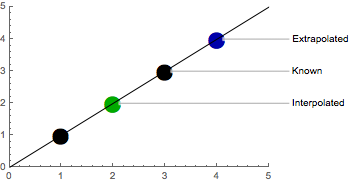
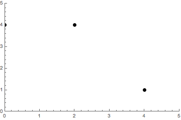
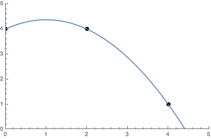
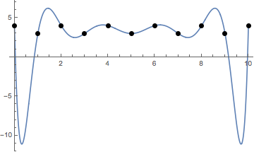
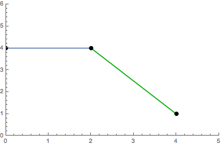
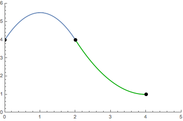
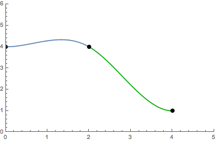

Approximating continuously defined functions from given discrete data is an unavoidable task in various fields. Interpolation represents the relatively easiest approach, where an approximating function is constructed that has to perfectly agree with the given points.

If $x_0 \ldots x_n$ and $f(x_0) \ldots f(x_n)$ are known and if $x_0 < x < x_n$, then the estimated value of $f(x)$ is said to be an *Interpolation*. If $x < x_0$ or $x > x_n$ then the estimated value is said to be an *Extrapolation*.

{.width-medium .themed}

In other words: with interpolation, we want to estimate values *between* already known values, and with extrapolation, we want to estimate values *outside* already known values. 

## Polynomial Interpolation

Polynomial interpolation interpolates a given data set by the polynomial of the lowest possible degree that passes through all the dataset points. Interpolation inevitably leads to a problem in linear algebra where we have to solve a system of linear equations.

Let's work through an example with the points

$$(0, 4)\qquad (2, 4)\qquad (4, 1).$$

The example points can be visualized as follows.

{.width-medium .themed}

### Direct Interpolation

We need at least $n + 1$ data points to solve a polynomial of degree $n$. 

:::{.theorem}
The resulting polynomial is *unique* because an $n$-degree polynomial has at most $n$ roots.
:::

:::{.proof}
Suppose we interpolate through $n + 1$ data points with a polynomial $p(x)$ of degree $\leq n$. Suppose another polynomial $q(x)$ exists also of degree $\leq n$ that also interpolates the $n + 1$ points.

1. Consider $r(x) = p(x) - q(x)$

We know that $r(x)$ is is a polynomial of degree at most $n$ because we are just subtracting polynomials. At the $n + 1$ data points $r(x_i) = p(x_i) -q(x_i) = 0$, therefore $r(x)$ has $n + 1$ roots.

2. We get $r(x) = 0$

By the fundamental theorem of algebra $r(x)$ can only have more than $n$ roots if $r(x) = 0$.

3. Therefore $r(x) = 0 \implies p(x) = q(x)$
:::

The direct method assumes the following polynomial:

$$y=f(x)=c_0+c_1x + c_2 x^2 + \ldots + c_n x^n$$

With $n + 1$ given points $(x_0,y_0) \ldots (x_n,y_n)$ we have to solve $n + 1$ linear equations to find all coefficients $c_0, c_1,\ldots, c_n$ for the interpolating polynomial of degree $n$.

$$
\begin{aligned}
4 = c_0 + 0c_1 + 0^2c_2 \\
4 = c_0 + 2c_1 + 2^2c_2 \\
1 = c_0 + 4c_1 + 4^2c_2
\end{aligned}
$$

This linear system of equations can be described by a special kind of matrix known as the [Vandermonde Matrix](https://en.wikipedia.org/wiki/Vandermonde_matrix).

$$
\left(
\begin{array}{ccc}
 1 & 0 & 0 \\
 1 & 2 & 4 \\
 1 & 4 & 16 \\
\end{array}
\right)
\left(
\begin{array}{ccc}
 c_0 \\
 c_1 \\
 c_2 \\
\end{array}
\right) =
\left(
\begin{array}{ccc}
 4 \\
 4 \\
 1 \\
\end{array}
\right)
$$

The polynomial basis looks like $B = \{1, x, x^2, \ldots, x^n\}$, as represented by the columns of the Vandermonde matrix. Our resulting interpolating polynomial is a *linear combination* of this basis.

$$P(x) = 4 + \frac{3}{4}x - \frac{3}{8}x^2$$

Unfortunately, we have to invert the Vandermonde matrix to solve for the coefficients $c_0, c_1 \ldots, c_n$. Let's see if we can find a better basis to find the coefficients.

### Lagrange Interpolation

Lagrange polynomials are based on the beautiful idea that you could express the interpolating polynomial $P$ as a linear combination of polynomials $p_0 \ldots p_n$, that individually fit a specific given point.^[MathTheBeautiful offers a series of videos on polynomial interpolation that contains an [introduction to Lagrange polynomials](https://www.youtube.com/watch?v=XK4G5Ndy-m8).]

We will arrive at the same unique polynomial that we have calculated before but with a completely different way of constructing it.

Our goal is to create multiple polynomials that are $1$ at a specific point $(x_i, y_i)$ and $0$ at all other given points.

Let's create a polynomial $p(x) = (x - 0)(x - 2)(x - 4)$ that is $0$ at all values for $x$. We will now create polynomials that individually cancel out one of the terms.

$$
\begin{aligned}
p_0(x) = p(x)/(x - 0) \\
p_1(x) = p(x)/(x - 2) \\
p_2(x) = p(x)/(x - 4)
\end{aligned}
$$

Each of these polynomials is $1$ at a point $x_i$, and simultaneously $0$ at all other points. Because we know the values $y_i$ for each $x_i$, we have found our coefficients without having to invert a matrix!

Notice that we can now create a basis $B = \{\frac{p_0(x)}{p_0(x_0)}, \frac{p_1(x)}{p_1(x_1)}, \ldots, \frac{p_n(x)}{p_n(x_n)}\}$ for which we know that the coefficients are $y_0, y_1 \ldots y_n$. We can again write the polynomial $P$ as a linear combination of our new basis $B$.

$$
P(x) = 4 \frac{p_0(x)}{p_0(0)} + 4 \frac{p_1(x)}{p_1(2)} + 1 \frac{p_2(x)}{p_2(4)}
$$

Keep in mind that this [intuitive way of writing Lagrange polynomials](https://math.stackexchange.com/questions/523907/explanation-of-lagrange-interpolating-polynomial) requires simplification before evaluation to avoid division by zero.

$$P(x) = 4 + \frac{3}{4}x - \frac{3}{8}x^2$$

### Newton Interpolation

One of the most important features of Newton’s interpolation method is that we can gradually increase the interpolated data points without recomputing what is already computed.

When an additional point $(x_{n+1}, y_{n+1})$ is to be used, all previous basis polynomials and their corresponding coefficients remain unchanged, and we only need to obtain a new basis polynomial of degree $n + 1$.

Let's calculate the Newton interpolation for our example.^[Ruye Wang wrote a more in-depth tutorial on Newton interpolation and other interpolation methods, which can be found [here](http://fourier.eng.hmc.edu/e176/lectures/ch7/node4.html).]

$$
\begin{aligned}
4 = c_0 + c_1(0 - 0) + c_2(0 - 0)(0 - 2) \\
4 = c_0 + c_1(2 - 0) + c_2(2 - 0)(2 - 2) \\
1 = c_0 + c_1(4 - 0) + c_2(4 - 0)(4 - 2) \\
\end{aligned}
$$

We can simplify that expression and write it in matrix form

$$
\left(
\begin{array}{ccc}
 1 & 0 & 0 \\
 1 & 2 - 0 & 0 \\
 1 & 4 - 0 & (4 - 0)(4 - 2) \\
\end{array}
\right)
\left(  
\begin{array}{ccc}
 c_0 \\
 c_1 \\
 c_2 \\
\end{array}
\right) =
\left(
\begin{array}{ccc}
 4 \\
 4 \\
 1 \\
\end{array}
\right).
$$

We can solve that system of linear equations progressively from top to bottom without having to invert the matrix. In contrast to the other interpolation methods, the basis now looks like

$$B = \{1, (x - x_0), (x - x_0)(x - x_1), \ldots, \prod_{i=0}^n(x - x_i)\}.$$

If we need to interpolate another point, we can reuse our previous results and solve another row.

$$P(x) = 4 + 0(x-0) - \frac{3}{8}(x-0)(x-2) = 4 + \frac{3}{4}x - \frac{3}{8}x^2$$

### Runge's Phenomenon

We have now seen that all polynomial interpolation methods for $n + 1$ data points result in the same unique polynomial of degree $n$. All of the methods for polynomial interpolation were expressed in terms of a basis $B$ weighted by some coefficients. The interpolating polynomial for our previous example looks as follows.

{.width-medium .themed}

A problem that arises with polynomial interpolation is the interpolating function tends to oscillate more and more with more points added. This is called the *Runge's phenomenon*. It limits the use cases where simple polynomial interpolation is appropriate.

{.width-medium .themed}

Another limitation of polynomial interpolation is that touching a single point causes a recalculation of all other points.

## Piecewise Interpolation

To address the limitations mentioned, we could combine multiple polynomials of lower degree that each fit an interval between two points.

$$
S(x)=
\left\{\begin{array}{cc}
P_0(x) & x_0 \le x \le x_1 \\
\vdots & \vdots\\
P_n(x) & x_{n-1} \le x \le x_n
\end{array}\right.
$$

The function $S(x)$ defined by piecewise polynomials is known as a *Spline*. We usually want a spline interpolation to consist of low-degree polynomials, to be *continuous* and to be *smooth*.

In other words we want two consecutive piecewise polynomials to meet at some point $P_i(x_i) = P_{i + 1}(x_i)$ and to have the same derivative at that point $P_i^{(k)}(x_i) = P_{i + 1}^{(k)}(x_i)$ where $k$ stands for the *kth*-derivative.

### Linear Splines

A linear spline, as the name implies, describes first-degree polynomials of the form $P(x) = c_0 + c_1 x$. Each linear polynomial has $2$ unkown parameters, our spline of $n$ piecewise polynomials for $n + 1$ data points thus has a total of $2n$ unknown parameters.

{.width-medium .themed}

The *continuity condition*, that consecutive polynomials to meet at some point, needs $2n$ free parameters to be fulfilled. Linear splines can thus only fulfill that condition.

$$
\begin{aligned}
P_0x_{i - 1}) &= a_0 + a_1 x_{i - 1} & 4 &= a_0 + 0 a_1 \\
P_0(x_i) &= a_0 + a_1 x_i & 4 &= a_0 + 2 a_1 \\
P_1(x_i) &= b_0 + b_1 x_i & 4 &= b_0 + 2 b_1 \\
P_1(x_{i + 1}) &= b_0 + b_1 x_{i + 1} & 1 &= b_0 + 4 b_1
\end{aligned}
$$

This leads to a major drawback of linear splines: they are not smooth and hence are usually not differentiable at points where two consecutive polynomials meet.

$$
S(x)=
\left\{\begin{array}{lc}
P_0(x) = 4 & 0 \le x \le 2 \\
& \\
P_1(x) = 7 - \frac{3}{2}x & 2 \le x \le 4
\end{array}\right.
$$

### Quadratic Splines

Quadratic polynomials add one more degree of freedom, and quadratic splines consequently have $3n$ unknown parameters. Again, we need $2n$ parameters for continuity, but we can now also specify that two consecutive polynomials should match in their first derivative.

{.width-medium .themed}

The *smoothness condition* needs $n - 1$ free parameters, because there are $n - 1$ "inner points" for $n + 1$ data points.

$$
\begin{aligned}
P_0(x_{i - 1}) &= a_0 + a_1 x_{i - 1} + a_2 x_{i - 1}^2 & 4 &= a_0 + 0 a_1 + 0^2 a_2 \\
P_0(x_i) &= a_0 + a_1 x_i + a_2 x_i^2 & 4 &= a_0 + 2 a_1 + 2^2 a_2 \\
P_1(x_i) &= b_0 + b_1 x_i + b_2 x_i^2 & 4 &= b_0 + 2 b_1 + 2^2 b_2 \\
P_1(x_{i + 1}) &= b_0 + b_1 x_{i + 1} + b_2 x_{i + 1}^2 & 1 &= b_0 + 4 b_1 + 4^2 b_2
\end{aligned}
$$

We need another equation ($n - 1 = 1$) to make sure that two consecutive polynomials have a common first derivative.

$$
P_0'(x_i) = P_1'(x_i)\qquad a_1 + 4 a_2 = b_1 + 4 b_2
$$

Now, we have a total of $5$ equations for $3n = 6$ unknown parameters. For us to be able to solve the equations we have $3n - 2n - (n - 1) = 1$ free parameter left. We can choose one more solvable constraint of our liking, for example, that the first derivative should be $0$ at the last point.

$$
P_1'(x_n) = 0\qquad 0 = b_1 + 8 b_2
$$

Our quadratic spline is now defined as

$$
S(x)=
\left\{\begin{array}{lc}
P_0(x) = 4 + 3x - \frac{3}{2}x^2 & 0 \le x \le 2 \\
& \\
P_1(x) = 13 - 6x + \frac{3}{4}x^2 & 2 \le x \le 4
\end{array}\right..
$$

### Cubic Splines

With another degree of freedom, we can specify that two consecutive polynomials share a common first and second derivative at the point they meet.

{.width-medium .themed}

We now have $4n$ unknown parameters of which $2n$ are bound by the continuity condition.

$$
\begin{aligned}
P_0(x_{i - 1}) &= a_0 + a_1 x_{i - 1} + a_2 x_{i - 1}^2 + a_3 x_{i - 1}^3 & 4 &= a_0 + 0 a_1 + 0^2 a_2 + 0^3 a_3 \\
P_0(x_i) &= a_0 + a_1 x_i + a_2 x_i^2 + a_3 x_i^3 & 4 &= a_0 + 2 a_1 + 2^2 a_2 + 2^3 a_3 \\
P_1(x_i) &= b_0 + b_1 x_i + b_2 x_i^2 + b_3 x_i^3 & 4 &= b_0 + 2 b_1 + 2^2 b_2 + 2^3 b_3 \\
P_1(x_{i + 1}) &= b_0 + b_1 x_{i + 1} + b_2 x_{i + 1}^2 + b_3 x_{i + 1}^3 & 1 &= b_0 + 4 b_1 + 4^2 b_2 + 4^3 b_3
\end{aligned}
$$

A further $2(n - 1)$ parameters are bound by the smoothness condition for the first and second derivatives.

$$
\begin{aligned}
P_0'(x_i) &= P_1'(x_i) & a_1 + 4 a_2 + 12 a_3 &= b_1 + 4 b_2 + 12 b_3 \\
P_0''(x_i) &= P_1''(x_i) & 2 a_2 + 12 a_3 &= 2 b_2 + 12 b_3
\end{aligned}
$$

We now have $4n - 2n - 2(n - 1) = 2$ parameters left for constraints of our choice, which is often exactly what we want for spline interpolation.

$$
\begin{aligned}
P_0''(x_0) &= 0 & a_1 = 0 \\
P_1''(x_n) &= 0 & b_1 + 8 b_2 + 48 b_3 = 0
\end{aligned}
$$

Our cubic spline is now defined as

$$
S(x)=
\left\{\begin{array}{lc}
P_0(x) = 4 + \frac{9}{16}x^2 - \frac{9}{32}x^3 & 0 \le x \le 2 \\
& \\
P_1(x) = -2 + 9x - \frac{63}{16}x^2 + \frac{15}{32}x^3 & 2 \le x \le 4
\end{array}\right..
$$

The following constraints are often used for the two free parameters:

- *Natural* cubic splines have their second derivative at the first and last point set to zero. $P_0''(x_0) = 0$ and $P_n''(x_n) = 0$.
- *Complete* cubic splines use the first derivative of the function to be interpolated if known $P_0'(x_0) = f'(x_0)$ and $P_n'(x_n) = f'(x_n)$
- *Correct* cubic splines use the second derivative of the function to be interpolated if known $P_0''(x_0) = f''(x_0)$ and $P_n''(x_n) = f''(x_n)$.

Finally, we have covered all the basics about splines!^[For more information about splines, the University of Houston offers a [great tutorial](https://www.math.uh.edu/~jingqiu/math4364/spline.pdf) on how to calculate different splines.]
