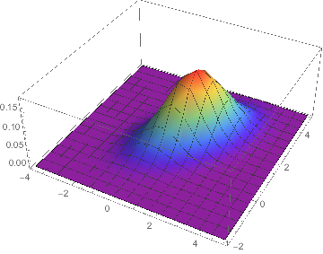
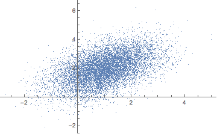
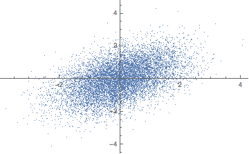
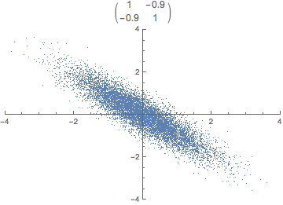
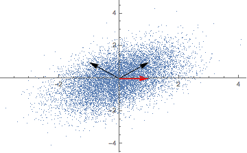
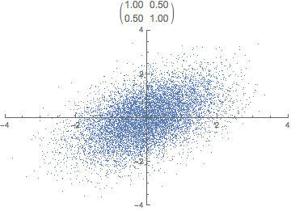

A data set of real-valued measurements can be described by a matrix $X$. We have some number of measurements $n$, each with a number of attributes $m$. Thus, $X$ can be represented as a Matrix $\mathbb{R}^{n \times m}$.

PCA is about finding a new basis that expresses our data in a lower-dimensional space. That is, we want to find a transformation matrix $P$ to transform $X$ into a lower-dimensional matrix $Y$ that provides a reasonable characterization of the complete data set.

$$Y = P \cdot X$$

The goals of PCA are: (1) minimize redundancy in our data set, and (2) preserve maximal variance within the data.

![Correlation and Redundancy [@Shlens:2014vi]](redundancy.png){.width-large .themed}

PCA comes with assumptions:

1. *Linearity & Orthogonality* - we use covariance, a linear relationship, as a measure of redundancy and are restricted to express the data set in an orthogonal basis^[We are restricted to an orthogonal basis because the covariance matrix, on which our calculations are based on, is symmetric. Check out [this StackExchange answer](https://stats.stackexchange.com/a/130884) for more information.]
2. *Greater Variance Means Greater Information*, directions with greater variance are assumed to represent a more interesting structure 

Let's calculate an example PCA with Mathematica. We should first generate some example data.

```{.mathematica .width-full}
distribution = MultinormalDistribution[{1, 2}, {{1, .5}, {.5, 1}}];
```

{.width-medium .themed}

We create $10000$ data points that follow our specified distribution.

```{.mathematica .width-full}
data = RandomVariate[distribution, 10^4];
```

{.width-medium .themed}

## Standardization

Standardization is also known as feature scaling, and there are [different ways to scale variables](https://en.wikipedia.org/wiki/Feature_scaling). It's on us to decide if there are features that should contribute more or less.

In our example, we know that the data is normally distributed, and we want to scale our variables to mean $0$ and standard deviation $1$, also known as [standard normalization](https://en.wikipedia.org/wiki/Normalization_(statistics)): $X - \mu \over \sigma$.

```{.mathematica .width-full}
standardize[A_] := (A - Mean[A])/StandardDeviation[A];
```

Keep in mind that we want to standardize each feature (column), not each observation (row).

```{.mathematica .width-full}
data = Map[standardize, Transpose[data]] // Transpose;
```

{.width-medium .themed}

## Covariance Matrix

Each observation can be seen as a point in $m$-dimensional space. [Covariance](http://mathworld.wolfram.com/Covariance.html) is the sum of signed squares between all points. Covariance thus tells us if the values tend to increase or decrease together.

$$\text{cov}(x,y) = E[(x_i - \bar x)(y_i - \bar y)]$$

![Covariance as the Sum of Signed Squares [@Hedderich:2015ge]](covariance.png){.width-medium .themed}

The covariance matrix (positive semi-definite $\mathbb R^{m \times m}$) is the collection of covariances between all features. Note that the covariance of a feature with itself is the variance of that feature. Thus, the diagonal of the covariance matrix is the variance of the corresponding feature.

```{.mathematica .width-full}
covarianceMatrix[A_] := Module[{Ats},
  Ats = Map[# - Mean[#] &, Transpose[A]];
  Ats.(Transpose [Ats])/(Length[A] - 1)
]
```

Recap that one of our goals was to minimize redundancy in our transformed data set. With the notion of covariance, we can state that goal more formally: all off-diagonal items of $\text{covmat}(Y)$ should be zero. In other words: we decorrelate the data.

{.width-medium .themed}

```{.mathematica .width-full}
covmat = covarianceMatrix[data]
```

An interesting thing about covariance matrices is that they define a specific linear transformation - a linear transformation in the directions of variance.^[Vincent Spruyt wrote [an article](http://www.visiondummy.com/2014/04/geometric-interpretation-covariance-matrix/) about the geometric interpretation of covariance matrices.] Can you guess what the covariance matrix of our standardized data looks like?

$$
\text{covmat} \approxeq
\left(
\begin{array}{cc}
 1 & \frac{1}{2}  \\
 \frac{1}{2}  & 1 \\
\end{array}
\right)
$$

Repeatedly applying a linear transformation, in this case, our covariance matrix, to a randomly chosen vector $(1,0)$ seems to converge in some direction, but what are those mysterious black arrows?

{.width-medium .themed}

## Eigendecomposition

Eigenvectors are the directions along which a linear transformation acts by stretching/compressing or flipping space. Eigenvalues, on the other hand, determine the magnitude of the transformation.^[There are excellent introductions to eigenvalues and eigenvectors available online, see [Explained Visually](http://setosa.io/ev/eigenvectors-and-eigenvalues/), [Stackexchange](https://math.stackexchange.com/questions/23312/what-is-the-importance-of-eigenvalues-eigenvectors/23325), [Youtube](https://www.youtube.com/watch?v=PFDu9oVAE-g)]

(@eigeneq) Let $A$ be a square matrix, a scalar $\lambda$ is called **Eigenvalue** of $A$ if there is a *non-zero* vector $v$, called an **Eigenvector**, such that $Av = \lambda v$.

The eigenvalues and eigenvectors can be calculated by directly solving (@eigeneq). Let us, therefore, rewrite the equation:

$$Av - \lambda v = 0$$
$$(A - \lambda I) v = 0$$

We have now formed a homogeneous linear system of equations. A homogeneous linear system has a nonzero solution if and only if it's coefficient matrix, in this case, $A - \lambda I$, is singular:

$$\text{det}(A - λ I) = 0$$

Let's solve this equation for our simple example to get the eigenvalues.

$$
\begin{aligned}
\text{det}
\left(
\begin{array}{cc}
 1 - \lambda & \frac{1}{2} \\
 \frac{1}{2} & 1 - \lambda \\
\end{array}
\right) = 0 \\
(1 - \lambda)^2 - \frac{1}{4} = 0 \\
\lambda_1 = \frac{1}{2}, \lambda_2 = \frac{3}{2}
\end{aligned}
$$

We can now solve (@eigeneq) to get the eigenvectors.

$$
\begin{aligned}
v_1 + \frac{1}{2}v_2 = \frac{1}{2}v_1 \\
\frac{1}{2}v_1 + v_2 = \frac{1}{2}v_2 \\
-v_1 = v_2
\end{aligned}
$$

$$
\begin{aligned}
v_1 + \frac{1}{2}v_2 = \frac{3}{2}v_1 \\
\frac{1}{2}v_1 + v_2 = \frac{3}{2}v_2 \\
v_1 = v_2
\end{aligned}
$$

A solution for our eigenvectors thus is $(-1, 1)$ and $(1, 1)$ - the mysterious black arrows from the figure above! We can check our solution with:

```{.mathematica .width-full}
Eigensystem[covmat]
```

## Principal Components

Principal components are defined in a way that the first principal component has the largest possible variance in a specific direction (that is, accounts for as much of the variability in the data as possible), and each succeeding component, in turn, has the highest variance possible under the constraint that it is orthogonal to the preceding components.

We have to sort all eigenvalues in descending order and choose $k$ eigenvectors that correspond to the $k$ largest eigenvalues. The eigenvalues in the case of the covariance matrix represent the magnitude of variance.

The $k$ chosen vectors are our principal components! Principal components are thus nothing more than sorted eigenvectors of the covariance matrix represented as a transformation matrix $P$.

```{.mathematica .width-full}
Transpose[Eigenvectors[covmat]]
```

$$
P =
\left(
\begin{array}{cc}
 1 & -1 \\
 1 & 1 \\
\end{array}
\right)
$$

What do you think happens if we apply that transformation matrix to our standardized data set? Notice how the covariance matrix changes.

{.width-medium .themed}

In reality, the transformation happens in one step, the dot product of $P \cdot X$. The animation is just for illustrative purposes.

Another challenge is to find a good value for $k$. The sum of all eigenvalues fully explains the variation in the data.

{.width-medium .themed}

In our example, the only sensible value for $k$ would be $1$ since we only have $2$ dimensions. It turns out that we will lose $\frac{1}{4}$ of variation by reducing our dataset from two to one dimension.

$$
P =
\left(
\begin{array}{cc}
 1 \\
 1
\end{array}
\right)
$$

{.width-medium .themed}

There is a closely related matrix-decomposition technique known as Singular Value Decomposition (SVD) that can be used to calculate the principal components. See [@Shlens:2014vi] for a PCA tutorial for the relationship between PCA and SVD and how to perform an SVD.
